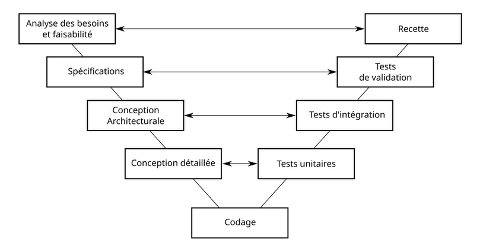
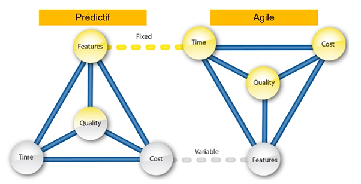
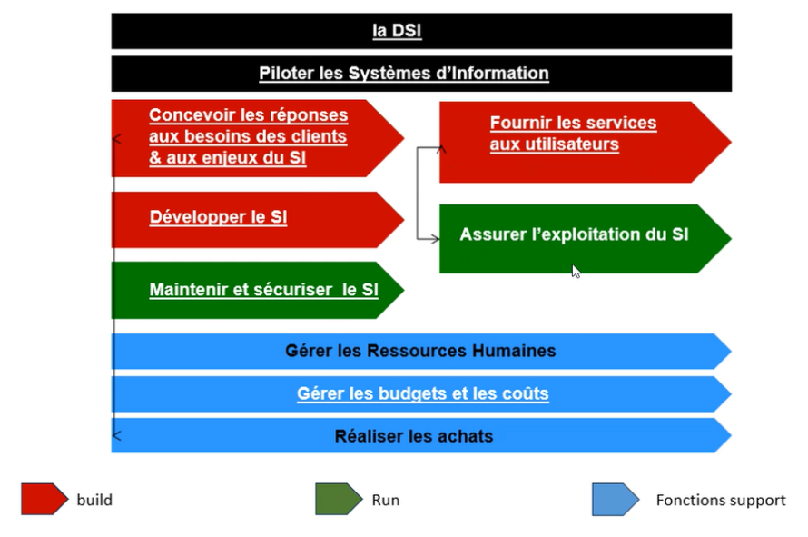
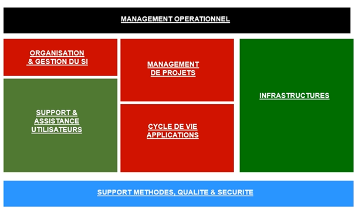
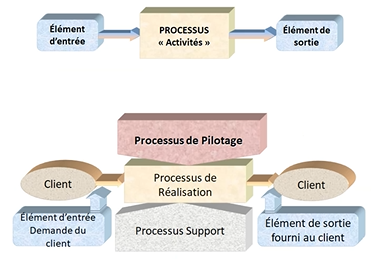
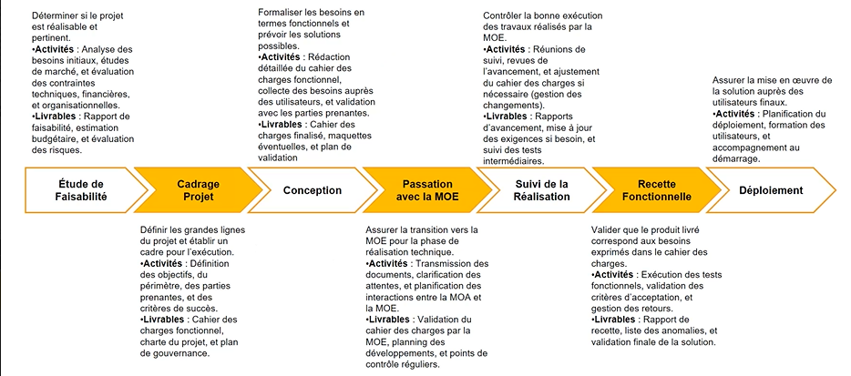
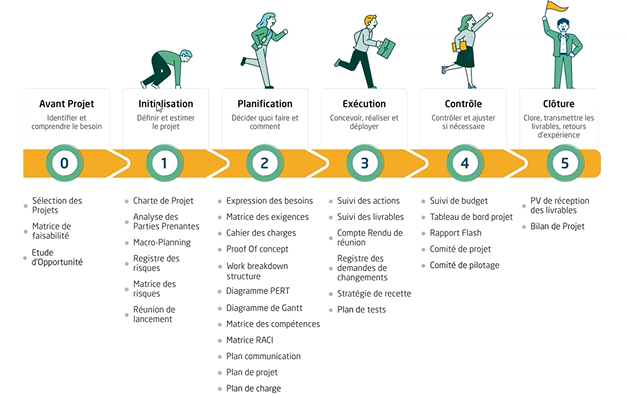

# **Fondamentaux - Gestion de projet informatique**

---

## **Sommaire**

- [Sommaire](#sommaire)
- [Définition d'un projet informatique](#définition-dun-projet-informatique)
- [Que doit avoir et être un projet ?](#que-doit-avoir-et-être-un-projet-)
  - [Le projet doit avoir](#le-projet-doit-avoir)
  - [Le projet doit être SMART](#le-projet-doit-être-smart-)
- [La gestion de projet côté client](#la-gestion-de-projet-côté-client)
  - [Les 3 mot clé important pour la gestion projet](#les-3-mot-clé-important-pour-la-gestion-projet)
  - [La triple contrainte du projet](#la-triple-contrainte-du-projet)
  - [Les objectifs des mots clé](#les-objectifs-des-mots-clé)
- [Les échecs](#les-échecs)
- [Vue d'ensemble des deux types de projet](#vue-densemble-des-deux-types-de-projet)
  - [Cycle en cascade des projets prédictifs - Watterfall](#cycle-en-cascade-des-projets-prédictifs---watterfall)
  - [Cycle en V des projets prédictifs](#cycle-en-v-des-projets-prédictifs)
    - [Phase de conception](#phase-de-conception)
    - [Phase de vérification et validation](#phase-de-vérification-et-validation)
    - [Exemple visuel du cycle en V](#exemple-visuel-du-cycle-en-v)
  - [La gestion de projet Agile](#la-gestion-de-projet-agile)
  - [Prédictif vs Agile](#prédictif-vs-agile)
  - [Avantages et inconvénients du prédictif](#avantages-et-inconvénients-du-prédictif)
  - [Avantages et inconvénients de l'Agile](#avantages-et-inconvénients-de-lagile)
  - [Quel modèle choisir pour mon projet](#quel-modèle-choisir-pour-mon-projet)
- [À quoi ressemble le SI en entreprise](#à-quoi-ressemble-le-si-en-entreprise)
  - [Le SI en entreprise](#le-si-en-entreprise)
  - [Le pricipe et processus d'organisation](#le-pricipe-et-processus-dorganisation)
  - [Les ressources humaines dans le SI d'entreprise](#les-ressources-humaines-dans-le-si-dentreprise)
- [Terminologie](#terminologie)
- [Génie logiciel](#génie-logiciel)
  - [Approche processus ISO](#approche-processus-iso)
  - [Approche processus "Roue de Deming - PDCA"](#approche-processus-roue-de-deming---pdca)
- [Acteurs du projet et Gouvernance](#acteurs-du-projet-et-gouvernance)
  - [Les moyens humains : les rôles dans un projet](#les-moyens-humains--les-rôles-dans-un-projet)
- [Formalisme du besoin : cahier des charges](#formalisme-du-besoin--cahier-des-charges)
  - [Objectif du cahier des charges](#objectif-du-cahier-des-charges)
  - [Plan type d'un cahier des charges](#plan-type-dun-cahier-des-charges)
  - [Les acteurs concernés par le cahier des charges](#les-acteurs-concernés-par-le-cahier-des-charges)
  - [Contenu du cahier des charges](#contenu-du-cahier-des-charges)
- [Cycle de vie d'un projet en maîtrise d'ouvrage "MOA"](#cycle-de-vie-dun-projet-en-maîtrise-douvrage-moa)
- [Cycle de vie d'un projet en maîtrise d'oeuvre "MOE"](#cycle-de-vie-dun-projet-en-maîtrise-doeuvre-moe)

## **Définition d'un projet informatique**

> **Definition** :  
> Ensemble des tâches interdépendantes menées pour la réalisation d'un objectif précis
> nécessitant des ressouces multiple dans un contexte économique pendant une durée déterminée

---

## **Que doit avoir et être un projet ?**

La gestion de projet est un mode de fonctionnement adapté en entreprise pour accompagner les changements induits par les évolutions des technologies et des marchés

Pour la bonne gestion d'un projet, celui-ci doit avoir une personne qui manage le projet.  
Cet personne n'a pas besoin de connaître tous les aspects spécifiques pour réaliser le projet mais il est présent pour l'orchestré et veiller au bon déroulement de celui-ci.

### **<u>Le projet doit avoir</u>**:

1. Un objectif précis
   - Quantifié ou spécifié à une problématique ou à un besoin mesurable via des indicateurs.
2. Une limite dans le temps
   - Il a une date de début et une date de fin marqué par la livraison de l'ouvrage.
3. Une organisation non permanente
   - Une équipe constitué de plusieurs personnes de manière temporaire pour réaliser ensemble l'ouvrage.

### **<u>Le projet doit être SMART</u>** :

1. **<u>S (Spécifique)</u>**

- Précisez ce que vous voulez faire.
- Utilisez des verbes d'actions.

2. **<u>M (Mesurable)</u>**

- Définissez une méthode d'évaluation.
- Utilisez des indicateurs précis.

3. **<u>A (Atteignable)</u>**

- Possible d'accomplir, réalisable.
- Dans votre champ d'action.

4. **<u>R (Réaliste)</u>**

- Vos objectif doivent correspondre à vos valeurs et à vos objectifs à long terme.

5. **<u>T (Temporel)</u>**

- Indiquez quand vous le ferez.
- Soyez précis sur la date ou le délai.

---

## **La gestion de projet côté client**

### **<u>Les 3 mot clé important pour la gestion projet</u>**

Pour la gestion du projet, le client est central et 3 points sont important pour lui !

1. **<u>Qualité</u>** :

- Il s'agit du soin qui est apporté à la réalisation fonctionnelle et technique du projet.

2. **<u>Coûts</u>** :

- Un client est prêts à dépenser une certaines somme pour un projet (un budget dédié).

3. **<u>Délais</u>** :

- Savoir combien de temps doit durer la réalisation d'un projet et veiller au respect de ce délai.

### **<u>La triple contrainte du projet</u>**

Il existe 3 grandes contraintes côté client :

1. Délai de livraison **Rapide**
2. Projet **Pas Cher**
3. Projet **De bonne qualité**

Les cas que le client pourrait demander :

- Un projet avec **toutes ses contraintes**, alors ce ne sera **pas possible** (c'est NON!).
- Un projet avec un délai de **livraison rapide** et **pas cher**, alors il risque d'être laid et donc **pas qualitatif**.
- Un projet avec un délai de **livraison rapide** et de **bonne qualité**, alors ça **ça sera plus cher**, car pour respecter un délai court il faudra plus de ressources.
- Un projet de **bonne qualité** et **pas cher**, alors **ça sera plus lent** car sans un financement adapté, un projet de qualité prendra alors plus de temps à faire pour cause d'un manque de ressource.

Image illustatif :

### **<u>Les objectifs des mots clé</u>**

1. **<u>Qualité</u>** :

- Aptitude de la solution à satisfaire le besoin du maître d'ouvrage et/ou utilisateurs

2. **<u>Coûts</u>** :

- Coût de revient de la solution intégrant les coûts d'étude, de développement et de réalisation

3. **<u>Délais</u>** :

- Temps écoulé entre le début et la fin du projet, c'est à dire la mise en application de la solution
- Objectif délais = objectif de tenue des dates

---

## **Les échecs**

Les échecs ne sont pas forcément inutils, il sont **source d'experiences**.  
La majorité des entreprise ayant un taux d'échec important sont des entreprises chargé d'inovation.  
L'entreprise avec le plus haut taux d'échec est **Google** avec près de **80%** !

Une des solutions pour éviter le plus possible un échec est de prendre le temps de bien exprimer les besoins de son projet.

---

## **Vue d'ensemble des deux types de projet**

1. **<u>Projet prédictif</u>** : Prévoir des phases séquentielles avec un engagement sur un **planning précis** de réalisation
2. **<u>Projet agile</u>** : construire un processus **itératif et incrémental** qui consiste à découper le projet en plusieurs étapes qu'on appelle "itérations"

### **<u>Cycle en cascade des projets prédictifs - Watterfall</u>**

Les étapes s'exécute en séquence.  
Chaque étape dépend de l'étape précédente.

> **Waterfall** : Exigences => Analyse => Conception => Mise en oeuvre => Validation => Mise en service

### **<u>Cycle en V des projets prédictifs</u>**

#### **Phase de conception**

1. Analyse des besoin et faisabilité
2. Spécifications
3. Conception architecturale
4. Conception détaillée
5. Codage

#### **Phase de vérification et validation**

- **Tests unitaires** ← Conception détaillée
- **Tests d'intégration** ← Conception architecturale
- **Testd de validation** ← Spécifications
- **Recette** ← Analyse des besoins et faisabilité

#### **Exemple visuel du cycle en V**

### **<u>La gestion de projet Agile</u>**

> **Intro**  
> Né aux USA dans les années 2000, il repose sur le modèle itératif et incrémental qui vise à satisfaire les besoins réels des clients du projet.  
> Il repose sur 4 valeurs déclinées en 12 principes.

La méthode Agile est centré sur le client avec les **4 valeurs** suivantes :

1. **Priorité à la réactivité face au changement** plutôt qu'au suivi d'un plan.
2. **Priorité à l'intéraction avec les personnes** plutôt qu'aux processus et outils.
3. **Priorité à la collaboration avec le client** plutôt que la négociation de contrat.
4. **Priorité au produit fonctionnel et opérationnel** plutôt qu'à une documentation pléthorique.

### **<u>Prédictif vs Agile</u>**

### **<u>Avantages et inconvénients du prédictif</u>**

- <u>Avantages</u>:
  - Permet de représenter graphiquement les différentes étapes du projet.
  - Ses dépendances et sa chronologie, les tâches contribuent à la réussite du projet.
  - Permet d'établire le chemin critique (durée minimal du projet).
  - Utilise le diagramme de Gantt (perfectionner le chemin critique).
- <u>Inconvénients</u>:
  - Manque de flexibilité (déroulement séquentiel).
  - Peu de place aux changements et aux imprévus (implique de revoir le projet).
  - Le client ne voit le produit qu'à la livraison.
- <u>Conclusion</u>:
  - A privilégier lorsque le projet bénificie d'une vision claire dès le départ.

### **<u>Avantages et inconvénients de l'Agile</u>**

- <u>Avantages</u>:
  - Place les besoins du client au centre des priorités du projet.
  - Offre une plus grande flexibilité et une meilleure visibilité.
  - Permet à l'équipe d'être plus réactive aux attentes du client.
  - **Principes**:
    1. Satisfaire la clientèle en priorité.
    2. Acceullir favorablement les demandes de changement.
    3. Livrer le plus souvent possible des versions opérationnelles de l'application.
    4. Assurer une coopération permanente entre le client et l'équipe projet.
    5. Construire autour de personne motivées.
    6. Privilégier la conversation en face-à-face.
    7. Mesurer l'avancement du projet en matière de fonctionnalité de l'application
    8. Faire avancer le projet à un rythme soutenable et constant.
    9. Porter une attention continue à l'excellence technique et à la conception
    10. Faire simple.
    11. Responsabiliser les équipes.
    12. Ajuster à intervalles régulier son comportement et ses processus pour être plus efficace.
- <u>Incovénients</u>:
  - Un certains investissement, une collaboration totale.
  - Le client doit rester disponible et s'intéresser à son projet.
  - Pas adaptée aux entreprises avec une structure hiérarchique forte.
  - Rend difficile la vision d'un budget et des risques.
  - Pas une méthodologie, une démarche.
  - Il faut quand même définir les processus de réalisation des projets.
- <u>Conclusion</u>:
  - Offre une plus grande flexibilité et une meilleure visibilité dans la gestion du projet VS cycle en V.
  - Fait de plus en plus d'adeptes.

### **<u>Quel modèle choisir pour mon projet</u>**

Un modèle n'est pas forcément favorable à certains besoin.
Pour choisir au mieux son modèle, cela ce fait en fonction de 2 facteurs.

1. Le niveau d'incertitude
2. Le degré de contrôle et d'organisation des tâches

- **Agile** : Projet d'innovation(tech 3.0, start-up, marketing produit, offres...)
- Prédictif - cycle en V : Projet d'ingénierie, Industrie, BTP...
- **Amélioration continue - Lean six sigma** : Projet d'amélioration de l'efficacité opérationnelle et d'accompagnement à la transformation d'entreprises.

---

## **À quoi ressemble le SI en entreprise**

### **<u>Le SI en entreprise</u>**

### **<u>Le pricipe et processus d'organisation</u>**

### **<u>Les ressources humaines dans le SI d'entreprise</u>**

- **Organisation et Gestion du SI**
  - Consultant en systèmes d'information
  - Ubaniste des systèmes d'information (architecte)
  - Responsable du système d'information "métier" (domaine)
  - Gestionnaire d'applications (par rapport aux processus)
  - Chargé d'affaire internes (ou ingénieur d'affaires)
- **Management de projets**
  - Directeur de projets (ou de programme)
  - Chef de projet maitrise d'ouvrage (ou métier)
  - Chef de projet maitrise d'oeuvre (ou informatique)
- **Cycle de vie des applications**
  - Responsable des systèmes applicatifs (ou de domaine applicatif)
  - Concepteur - Développeur (Analyste - Réalisateur)
  - Testeur (Homologateur)
  - Intégrateur d'applications
  - Paramétreur de progiciels
- **Exploitation**
  - Technicien d'exploitation
  - Technicien poste de travail (micro)
  - Technicien réseaux - télécoms
  - Administrateur d'outils / de systèmes / de réseaux - télécoms
  - Administrateur de base de données (DBA)
  - Intégrateur d'exploitation
  - Pilote d'exploitation (superviseur)
  - Expert systèmes d'expoitation (ingénieur système)
  - Expert réseaux - télécoms
  - Architecte technique
- **Support et assistance aux utilisateurs**
  - Assistant fonctionnel (correspondant utilisateurs)
  - Technicien support utilisateur (Helpdesk, Hotline)
- **Support méthode, qualité et sécurité**
  - Expert méthode et outils / qualité / sécurité
  - Manager de contrat (responsable contrats fournisseurs)
  - Responsable sécurité des Systèmes d'Informations - RSSI
- **Support et assistance aux utilisateur**
  - Assistant fonctionnel (correspondant utilisateur)
  - Technicien support utilisateurs (Helpdesk, Hotline)
- **Management opérationnel**
  - Directeur des systèmes d'information
  - Responsable d'entité (informatique)
  - Responsable d'études
  - Responsable d'exploitation
  - Responsable réseau

---

## **Terminologie**

- **La Spécification**
  - traduction en spécifications fonctionnelles et techniques des besoins exprimés dans le cahier des charges ou dans l'expression de besoins.
- **La Conception**
  - Analyse, choix de la modélisation, définition de l'architecture, définition des modules et interfaces, définition des algorithmes.
- **L'Implantation**
  - Choix d'implantations, codage du logiciel dans un langage cible.
- **L'Intégration**
  - Assemblage des différentes parties du logiciel.
- **La Vérification**
  - Test fonctionnels, tests de la fiabilité, tests de la sûreté.
- **La Validation**
  - Recette du logiciel, conformité aux exigences du CDC.
- **Le Déploiement**
  - Livraison, Installation, Formation.
- **La Maintenance**
  - corrections, et évolutions.

---

## **Génie logiciel**

### **<u>Approche processus ISO</u>**

> Un processus se défini comme un ensemble d'activités corrélées (liées et interdépendantes) qui transforme des éléments d'entrée en éléments de sortie.  
> Un élément de sortie d'un processus constitue souvent l'élément d'entrée d'un autre processus ou transmis au client (produit ou service)

### **<u>Approche processus "Roue de Deming - PDCA"</u>**

---

## **Acteurs du projet et Gouvernance**

### **<u>Les moyens humains : les rôles dans un projet</u>**

La gestion des acteurs du projet, c'est :

- Prendre en compte les attentes et les contraintes des différentes parties prenantes
- Impliquer les partenaires tout au long de la vie du projet
- Créer les conditions d'une coopération efficace avec les ressources de l'entreprise mobilisables au cours du projet

**Maîtrise d'ouvrage (MOA) = client**
Centré sur les avantages attendus, anticipe / achète / définit / valide / arrête

**Maîtrise d'oeuvre (MOE) = fournisseur**  
Centré sur les objectifs de réalisation  
Analyse les risques, propose le plan d'actions  
Pilote la réalisation  
Optimise les ressources sur les 3 axes coût / délai / qualité

> Le chef de projet peut être MOA ou MOE

**Comités de pilotage / sponsor**  
Coordonnent, arbitrent, valident, équilibrent objectif / capacités / charges

| Ceux qui ....                                                         | Sont les ...                                              |
| :-------------------------------------------------------------------- | :-------------------------------------------------------- |
| demande, payent, utilisent ou décient d'arrêter le projet             | Client, maître d'ouvrage (MOA), commanditaire, bailleur   |
| pilotent le projet                                                    | Chef de projet, maître d'oeuvre (MOE)                     |
| réalisent le projet                                                   | Equipe projet : acteurs projet, prestataires, consultants |
| sont concernés, soutiennent ou s'opposent au projet sans y participer | Sponsors, parties prenantes (stakeholders)                |

Les principaux acteurs de la **"Core teams"** sont :

> **Le commanditaire "MOA"**, aussi appelé le client ou le représentant du client final .
> Dans le monde agile : **Business Owner** .
> Son rôle dans le projet sera au niveau "Sponsor" et consistera à **valider les jalons du projet, investir d'avantage de budget, arbitrer les situations complexes du projet**.

> **Le chef de projet**, souvent positionné au niveau de la **"MOE"**, il est responsable de la réussite globale du projet sous triptyque **"coûts"**, **"qualité"**, **"délai"**.  
> C'est le **garant de la constitution de son équipe, de son animation, et de la gestion de l'ensemble des chantiers, lots, risques, et communications, dans le respect du plannig projet**.

> Le **chef de chantier** fait partie de l'équipe projet et dispose d'un rôle clé dans la réussite de la tenu du planning.  
> Il est **responsable d'un ensemble de lots et donc de travaux nécessaires à la réalisation de l'ouvrage**.

> **Expert, développeur, architecte, Data Analyst**,...  
> Ce sont les acteurs clés du projet qui **réalisent les lots affectés à un chantier**.

## **Formalisme du besoin : cahier des charges**

### **<u>Objectif du cahier des charges</u>**

> Décrire de la façon la plus précise possible, avec un vocabulaire simple, les besoins auxquels le Maître d'oeuvre doit répondre de sorte à ce que chaque besoin soit :

> **Nécessaire**  
> indique tous les paramètres requis pour la conception et réalisation du projet

> **Réalisable**  
> exprime un besoin réaliste techniquement et financièrement dans le cadre du planning, du périmètre détaillé du projet et des moyens disponibles

> **Clair**  
> L'idée ou le besoin exprimé n'est pas susceptible d'être interprété différemment de ce que pense le maître d'ouvrage

> **Vérifiable**  
> l'époque de projet doit s'assurer qu'il existe des moyens de vérifier ce qui est requis

> **Cohérent**  
> il doit exprimer des besoins qui ne se contredisent pas entre eux

Outre son caractère essentiel en gestion de projet, le Cahier des Charges est un document contractuel décrivant ce qui est attendu du maître d'oeuvre par le maître d'ouvrage, exprimant un besoin ou un travail à réaliser et le contexte (clauses) dans lequel il doit être réalisé.

### **<u>Plan type d'un cahier des charges</u>**

<<<<<<< HEAD
- **Présentation générale du problème**
  - Objet
  - Contexte du projet
    - Situer le projet dans un programme plus vaste (étude en cours, ...)
    - Affecter les responsabilités
  - Expression du besoin
  - Environnement de la solution (produit et service)
  - Conditions de fonctionnement
- Expression fonctionnelle des besoins
  - Fonctions de service / Produit principales(aux)
  - Fonction complémentaires (Infogérance)
  - Contraintes
- Critères d'appréciation
- Cadre de réponse

### **<u>Les acteurs concernés par le cahier des charges</u>**

1. **Le Client (MOA)**

- Celui qui définit les besoins et exigences du projet.
- Il est souvent à l'origine du cahier des charges.

2. **Le Chef de projet**

- Responsable de la planification, de l'exécution et du suivi du projet.
- Il doit s'assurer que le cahier des charges est respecté.

3. **L'Équipe technique**

- Comprend les ingénieurs, développeurs et techniciens qui vont réaliser le projet.
- Ils interprètent les exigences techniques du cahier des charges.

4. **Fournisseurs**

- Si les éléments externes sont nécessaires (matériel, logiciels), les fournisseurs doivent être impliqués pour garantir que leurs produits répondent aux spécifications.

5. **Parties prenantes**

- Toute personne ou groupe ayant un intérêt dans le projet (utilisateurs finaux, direction, actionnaires, etc.).
- Ils peuvent fournir des retours importants sur les besoins et attentes.

6. **Auditeurs ou Experts**

- Parfois, des experts externes sont consultés pour s'assurer que le projet respecte les normes et réglementations en vigeur.

### **<u>Contenu du cahier des charges</u>**

1. **Introduction**

- Contexte du projet
- Objectifs généraux

2. **Présentation du projet**

- Description détaillée du projet
- Cibles et utilisateurs finaux

3. **Objectifs spécifiques**

- Résultats attendus
- Indicateurs de succès

4. **Exigences fonctionnelles**

- Fonctionnalités et caractéristiques du produit ou service
- Scénarios d'utilisation

5. **Exigences techniques**

- Technologies à utiliser
- Normes et standards à respecter

6. **Contraites**

- Budget
- Délais
- Ressources disponibles

7. **Planification**

- Chronologie des étapes du projet
- Dates clés et jalons

8. **Critères de qualité**

- Standards à atteindre
- Méthodes de vérification et validation

9. **Gestion des riques**

- Identification des risques potentiels
- Stratégies d'atténuation

10. **Livrables**

- Description des livrables attendus
- Modalités de livraison et de réception

11. Modalités de suivi et évaluation

- Processus de suivi de l'avancement
- Reporting

12. **Annexes**

- Documents supplémentaires (schémas, études de marché, etc.)

## **Cycle de vie d'un projet en maîtrise d'ouvrage "MOA"**

## **Cycle de vie d'un projet en maîtrise d'oeuvre "MOE"**

=======
aaa
>>>>>>> 50b9aaf (Test)
