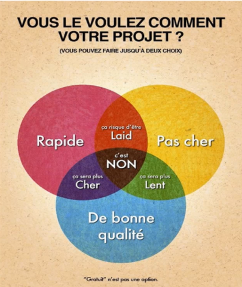

# **Fondamentaux - Gestion de projet informatique**

---

## **Sommaire**

- [Sommaire](#sommaire)
- [Définition d'un projet informatique](#définition-dun-projet-informatique)
- [Que doit avoir et être un projet ?](#que-doit-avoir-et-être-un-projet-)
  - [Le projet doit avoir](#le-projet-doit-avoir)
  - [Le projet doit être SMART](#le-projet-doit-être-smart-)
- [La gestion de projet côté client](#la-gestion-de-projet-côté-client)
  - [Les 3 mot clé important pour la gestion projet](#les-3-mot-clé-important-pour-la-gestion-projet)
  - [La triple contrainte du projet](#la-triple-contrainte-du-projet)
  - [Les objectifs des mots clé](#les-objectifs-des-mots-clé)
- [Les échecs](#les-échecs)
- [Vue d'ensemble des deux types de projet](#vue-densemble-des-deux-types-de-projet)
  - [Cycle en cascade des projets prédictifs - Watterfall](#cycle-en-cascade-des-projets-prédictifs---watterfall)
  - [Cycle en V des projets prédictifs](#cycle-en-v-des-projets-prédictifs)

## **Définition d'un projet informatique**

> **Definition** :  
> Ensemble des tâches interdépendantes menées pour la réalisation d'un objectif précis
> nécessitant des ressouces multiple dans un contexte économique pendant une durée déterminée

---

## **Que doit avoir et être un projet ?**

La gestion de projet est un mode de fonctionnement adapté en entreprise pour accompagner les changements induits par les évolutions des technologies et des marchés

Pour la bonne gestion d'un projet, celui-ci doit avoir une personne qui manage le projet.  
Cet personne n'a pas besoin de connaître tous les aspects spécifiques pour réaliser le projet mais il est présent pour l'orchestré et veiller au bon déroulement de celui-ci.

### **<u>Le projet doit avoir</u>**:

1. Un objectif précis
   - Quantifié ou spécifié à une problématique ou à un besoin mesurable via des indicateurs.
2. Une limite dans le temps
   - Il a une date de début et une date de fin marqué par la livraison de l'ouvrage.
3. Une organisation non permanente
   - Une équipe constitué de plusieurs personnes de manière temporaire pour réaliser ensemble l'ouvrage.

### **<u>Le projet doit être SMART</u>** :

1. **<u>S (Spécifique)</u>**

- Précisez ce que vous voulez faire.
- Utilisez des verbes d'actions.

2. **<u>M (Mesurable)</u>**

- Définissez une méthode d'évaluation.
- Utilisez des indicateurs précis.

3. **<u>A (Atteignable)</u>**

- Possible d'accomplir, réalisable.
- Dans votre champ d'action.

4. **<u>R (Réaliste)</u>**

- Vos objectif doivent correspondre à vos valeurs et à vos objectifs à long terme.

5. **<u>T (Temporel)</u>**

- Indiquez quand vous le ferez.
- Soyez précis sur la date ou le délai.

---

## **La gestion de projet côté client**

### **<u>Les 3 mot clé important pour la gestion projet</u>**

Pour la gestion du projet, le client est central et 3 points sont important pour lui !

1. **<u>Qualité</u>** :

- Il s'agit du soin qui est apporté à la réalisation fonctionnelle et technique du projet.

2. **<u>Coûts</u>** :

- Un client est prêts à dépenser une certaines somme pour un projet (un budget dédié).

3. **<u>Délais</u>** :

- Savoir combien de temps doit durer la réalisation d'un projet et veiller au respect de ce délai.

### **<u>La triple contrainte du projet</u>**

Il existe 3 grandes contraintes côté client :

1. Délai de livraison **Rapide**
2. Projet **Pas Cher**
3. Projet **De bonne qualité**

Les cas que le client pourrait demander :

- Un projet avec **toutes ses contraintes**, alors ce ne sera **pas possible** (c'est NON!).
- Un projet avec un délai de **livraison rapide** et **pas cher**, alors il risque d'être laid et donc **pas qualitatif**.
- Un projet avec un délai de **livraison rapide** et de **bonne qualité**, alors ça **ça sera plus cher**, car pour respecter un délai court il faudra plus de ressources.
- Un projet de **bonne qualité** et **pas cher**, alors **ça sera plus lent** car sans un financement adapté, un projet de qualité prendra alors plus de temps à faire pour cause d'un manque de ressource.

Image illustatif :

### **<u>Les objectifs des mots clé</u>**

1. **<u>Qualité</u>** :

- Aptitude de la solution à satisfaire le besoin du maître d'ouvrage et/ou utilisateurs

2. **<u>Coûts</u>** :

- Coût de revient de la solution intégrant les coûts d'étude, de développement et de réalisation

3. **<u>Délais</u>** :

- Temps écoulé entre le début et la fin du projet, c'est à dire la mise en application de la solution
- Objectif délais = objectif de tenue des dates

---

## **Les échecs**

Les échecs ne sont pas forcément inutils, il sont **source d'experiences**.  
La majorité des entreprise ayant un taux d'échec important sont des entreprises chargé d'inovation.  
L'entreprise avec le plus haut taux d'échec est **Google** avec près de **80%** !

Une des solutions pour éviter le plus possible un échec est de prendre le temps de bien exprimer les besoins de son projet.

---

## **Vue d'ensemble des deux types de projet**

1. **<u>Projet prédictif</u>** : Prévoir des phases séquentielles avec un engagement sur un **planning précis** de réalisation
2. **<u>Projet agile</u>** : construire un processus **itératif et incrémental** qui consiste à découper le projet en plusieurs étapes qu'on appelle "itérations"

### **<u>Cycle en cascade des projets prédictifs - Watterfall</u>**

Les étapes s'exécute en séquence.  
Chaque étape dépend de l'étape précédente.

> **Waterfall** : Exigences => Analyse => Conception => Mise en oeuvre => Validation => Mise en service

### **<u>Cycle en V des projets prédictifs</u>**

#### **Phase de conception**

1. Analyse des besoin et faisabilité
2. Spécifications
3. Conception architecturale
4. Conception détaillée
5. Codage

#### **Phase de vérification et validation**

- **Tests unitaires** ← Conception détaillée
- **Tests d'intégration** ← Conception architecturale
- **Testd de validation** ← Spécifications
- **Recette** ← Analyse des besoins et faisabilité

#### **Exemple visuel du cycle en V**

### **<u>La gestion de projet Agile</u>**

> **Intro**  
> Né aux USA dans les années 2000, il repose sur le modèle itératif et incrémental qui vise à satisfaire les besoins réels des clients du projet.  
> Il repose sur 4 valeurs déclinées en 12 principes.

La méthode Agile est centré sur le client avec les **4 valeurs** suivantes :

1. **Priorité à la réactivité face au changement** plutôt qu'au suivi d'un plan.
2. **Priorité à l'intéraction avec les personnes** plutôt qu'aux processus et outils.
3. **Priorité à la collaboration avec le client** plutôt que la négociation de contrat.
4. **Priorité au produit fonctionnel et opérationnel** plutôt qu'à une documentation pléthorique.

### **<u>Prédictif vs Agile</u>**

### **<u>Avantages et inconvénients du prédictif</u>**

- <u>Avantages</u>:
  - Permet de représenter graphiquement les différentes étapes du projet.
  - Ses dépendances et sa chronologie, les tâches contribuent à la réussite du projet.
  - Permet d'établire le chemin critique (durée minimal du projet).
  - Utilise le diagramme de Gantt (perfectionner le chemin critique).
- <u>Inconvénients</u>:
  - Manque de flexibilité (déroulement séquentiel).
  - Peu de place aux changements et aux imprévus (implique de revoir le projet).
  - Le client ne voit le produit qu'à la livraison.
- <u>Conclusion</u>:
  - A privilégier lorsque le projet bénificie d'une vision claire dès le départ.

### **<u>Avantages et inconvénients de l'Agile</u>**

- <u>Avantages</u>:
  - Place les besoins du client au centre des priorités du projet.
  - Offre une plus grande flexibilité et une meilleure visibilité.
  - Permet à l'équipe d'être plus réactive aux attentes du client.
  - **Principes**:
    1. Satisfaire la clientèle en priorité.
    2. Acceullir favorablement les demandes de changement.
    3. Livrer le plus souvent possible des versions opérationnelles de l'application.
    4. Assurer une coopération permanente entre le client et l'équipe projet.
    5. Construire autour de personne motivées.
    6. Privilégier la conversation en face-à-face.
    7. Mesurer l'avancement du projet en matière de fonctionnalité de l'application
    8. Faire avancer le projet à un rythme soutenable et constant.
    9. Porter une attention continue à l'excellence technique et à la conception
    10. Faire simple.
    11. Responsabiliser les équipes.
    12. Ajuster à intervalles régulier son comportement et ses processus pour être plus efficace.
- <u>Incovénients</u>:
  - Un certains investissement, une collaboration totale.
  - Le client doit rester disponible et s'intéresser à son projet.
  - Pas adaptée aux entreprises avec une structure hiérarchique forte.
  - Rend difficile la vision d'un budget et des risques.
  - Pas une méthodologie, une démarche.
  - Il faut quand même définir les processus de réalisation des projets.
- <u>Conclusion</u>:
  - Offre une plus grande flexibilité et une meilleure visibilité dans la gestion du projet VS cycle en V.
  - Fait de plus en plus d'adeptes.

### **<u>Quel modèle choisir pour mon projet</u>**

Un modèle n'est pas forcément favorable à certains besoin.
Pour choisir au mieux son modèle, cela ce fait en fonction de 2 facteurs.

1. Le niveau d'incertitude
2. Le degré de contrôle et d'organisation des tâches

- **Agile** : Projet d'innovation(tech 3.0, start-up, marketing produit, offres...)
- Prédictif - cycle en V : Projet d'ingénierie, Industrie, BTP...
- **Amélioration continue - Lean six sigma** : Projet d'amélioration de l'efficacité opérationnelle et d'accompagnement à la transformation d'entreprises.

## **À quoi ressemble le SI en entreprise**

